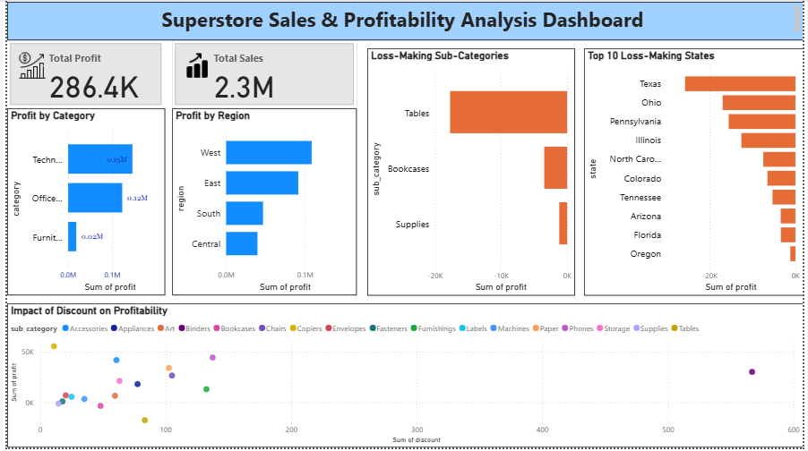
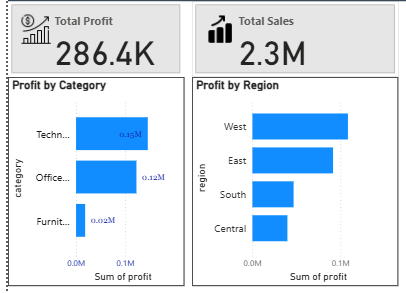
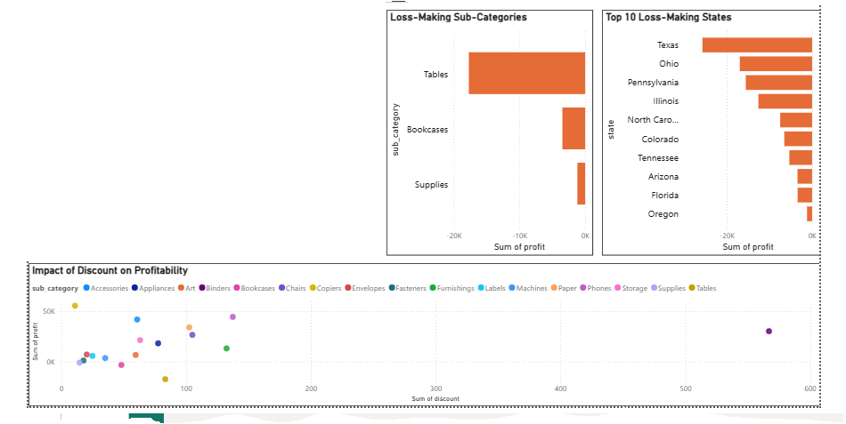

# 📊 Business Performance Dashboard

## Project Overview

This project presents an interactive Power BI dashboard developed to analyze retail sales performance across different regions, customer segments, product categories, and shipping modes.

The dashboard helps identify sales trends, profitability, customer behavior, and business opportunities to support data-driven decision-making.

## 🎯 Business Problem

Retail businesses generate large volumes of sales data across different regions, customer segments, product categories, and shipping modes. Without proper analysis, it becomes difficult to identify profitable areas, monitor business performance, and make informed decisions.

This dashboard was developed to transform raw sales data into meaningful business insights, enabling stakeholders to track key performance indicators (KPIs), identify trends, and support data-driven decision-making.

## 📂 Dataset

- **Dataset:** Superstore Sales Dataset (Sample Retail Dataset)
- **Source:** Kaggle
- **Records:** Retail sales transactions
- **Key Fields:** Sales, Profit, Quantity, Discount, Category, Sub-Category, Region, Segment, Ship Mode

- ## 🛠 Tools Used

- Microsoft Power BI
- SQL
- Microsoft Excel

## 📈 Key Performance Indicators (KPIs)

The dashboard focuses on the following business metrics:

- Total Sales
- Total Profit
- Total Quantity Sold
- Profit Margin
- Sales by Region
- Sales by Category
- Sales by Customer Segment
- Shipping Mode Analysis

- ## 🗄️ SQL Analysis

Before building the Power BI dashboard, SQL was used to explore and analyze the dataset.

Key SQL tasks performed:
- Imported the Superstore dataset into MySQL.
- Cleaned and validated the dataset.
- Calculated total sales and total profit.
- Analyzed profit by category and region.
- Identified loss-making states and sub-categories.
- Explored the relationship between discounts and profitability.

## 📷 Dashboard Preview

The following screenshots showcase the interactive Power BI dashboard and the key business analyses performed.

### Business Performance Dashboard

---

### Profitability Analysis

---

### Business Performance Analysis

## 💡 Business Insights

- Technology category generated the highest sales and profit, indicating strong customer demand.
- Office Supplies contributed consistent sales with moderate profitability.
- Furniture recorded lower profit margins despite high sales, suggesting higher operational costs or discounting.
- Western and Eastern regions contributed significantly to overall sales performance.
- Higher discounts negatively impacted profitability across multiple product categories.

- ## ✅ Business Recommendations

- Focus marketing efforts on high-performing Technology products to maximize revenue.
- Review discount strategies for Furniture to improve profitability.
- Expand successful sales strategies from high-performing regions to lower-performing regions.
- Monitor profit margins regularly to balance sales growth with business profitability.
- Use dashboard insights to support inventory planning and business decision-making.

- ## 🚀 Future Improvements

- Integrate real-time business data.
- Add customer retention and sales forecasting analysis.
- Build predictive dashboards using machine learning techniques.
- Connect the dashboard directly to SQL databases for automated reporting.

- ## 📁 Project Files

- [Business-Performance-Dashboard.pbix](Business-Performance-Dashboard.pbix) – Power BI project file for editing and customization.

- [Business-Performance-Dashboard.pdf](Business-Performance-Dashboard.pdf) – PDF version of the dashboard for quick viewing and sharing.

